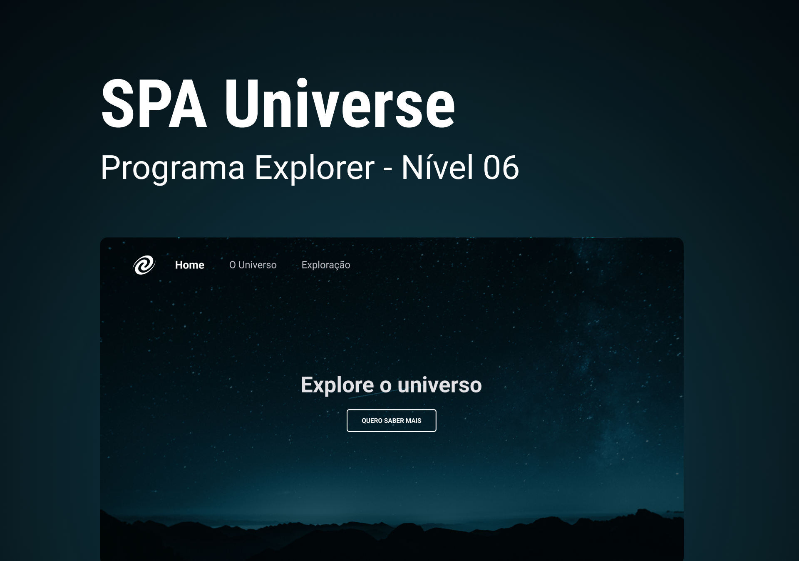

<h1 align="center"> SPA Universe </h1>

 

  <a href="#-tecnologias">Tecnologias</a>&nbsp;&nbsp;&nbsp;|&nbsp;&nbsp;&nbsp;
  <a href="#-descrição">Descrição</a>&nbsp;&nbsp;&nbsp;|&nbsp;&nbsp;&nbsp;
  <a href="#confira-o-projeto">Confira o projeto</a>&nbsp;&nbsp;&nbsp;

  

## 🚀 Tecnologias

Esse projeto foi desenvolvido com as seguintes tecnologias:

- HTML
- CSS
- JavaScript
- NodeJS
- Figma
- Git e Github

---

 

## 💻 Descrição

Landing page desenvolvida para aprender e praticar conceitos de SPA (Single page application) utilizando JavaScript e uma breve introdução á NodeJS.

**As funcionalidades do projeto são:**

- Landign page responsiva
- Conceitos de SPA aplicados
- Pequeno servidor desenvolvido utilizando NodeJs
- Menu navegável no cabeçalho, totalmente responsivo, assim como o corpo com conteúdo do projeto

 

## 🔑 Acesse o projeto!

## [SPAUniverse.io](https://eduvieira131.github.io/SPA-Universe/)

---

## Confira o projeto:

  Uma pequena amostra sobre o que esperar do projeto!

 

  

